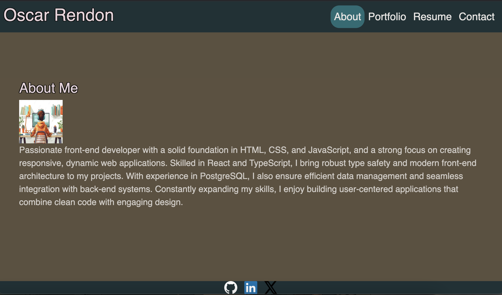

# My Portfolio

Welcome to my portfolio! This repository showcases my work as a full stack developer, including projects that demonstrate my skills and abilities in web development.

## Table of Contents

- [About Me](#about-me)
- [Projects](#projects)
- [Technologies Used](#technologies-used)
- [Contact](#contact)

## About Me

I am a passionate software developer with experience in building interactive and user-focused applications. My goal is to create efficient and scalable solutions that enhance user experience.

## Projects

### Project 1: [Weather App](https://woweather.onrender.com)
- Description: Weather app built with Typscript, Node.js.
- Technologies: Typescript, Node.js

### Project 2: [Indexd](https://danr55.github.io/Indexd/)
- Description: This project was built with JavaScript, HTML, and CSS.
- Technologies: List of technologies used.

## Technologies Used

- HTML
- CSS
- JavaScript
- React
- Node.js
- Express.js

## Contact

Feel free to reach out to me for any inquiries or collaboration opportunities!

- Portfolio link: [https://ohportfolio.netlify.app/]
- Email: [danrendon.5512@gmail.com]
- GitHub: [https://github.com/Danr55]
- LinkedIn: [https://www.linkedin.com/in/oscar-rendon-070b49326/]
